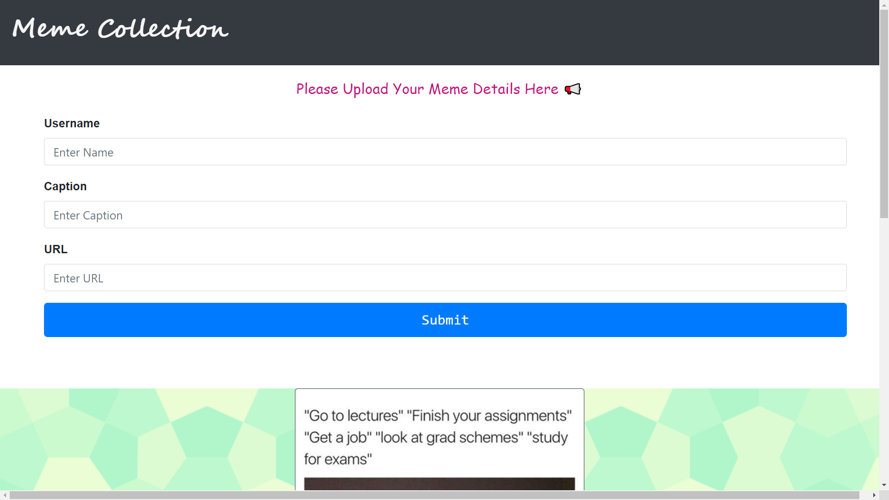
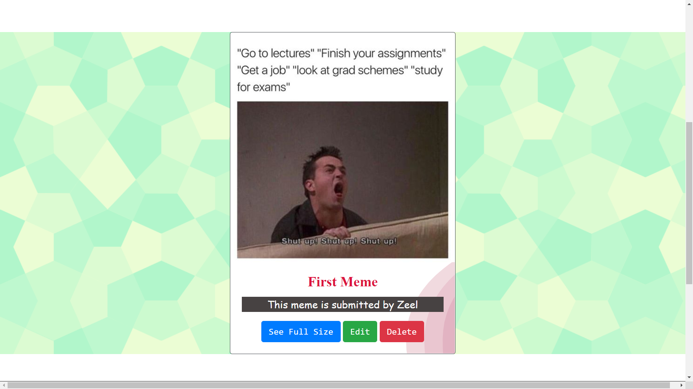
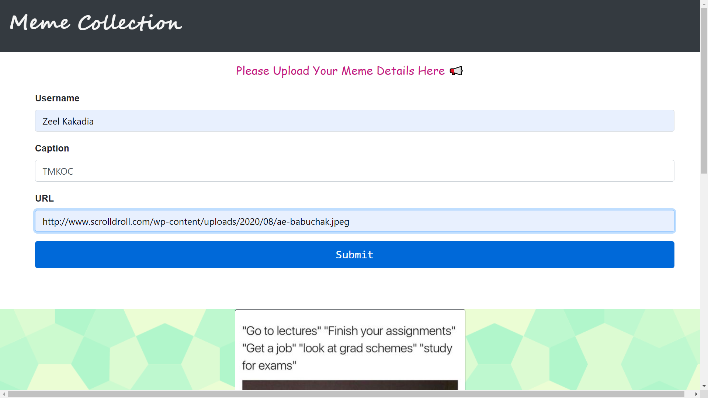
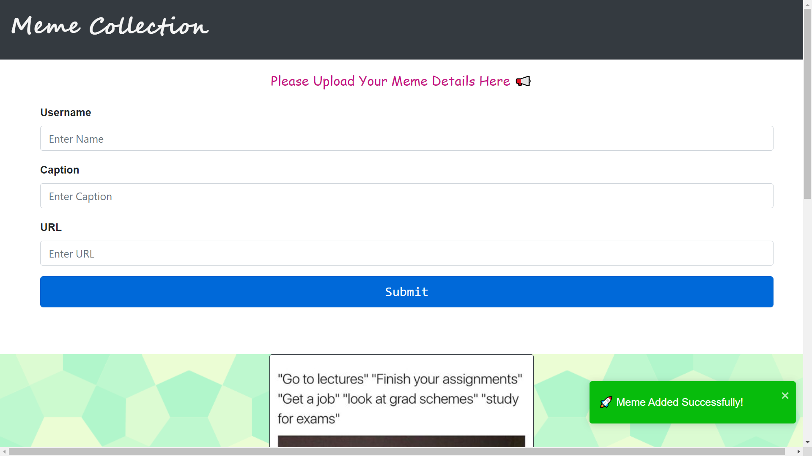
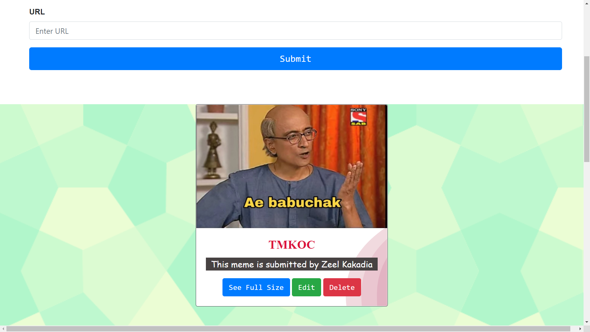
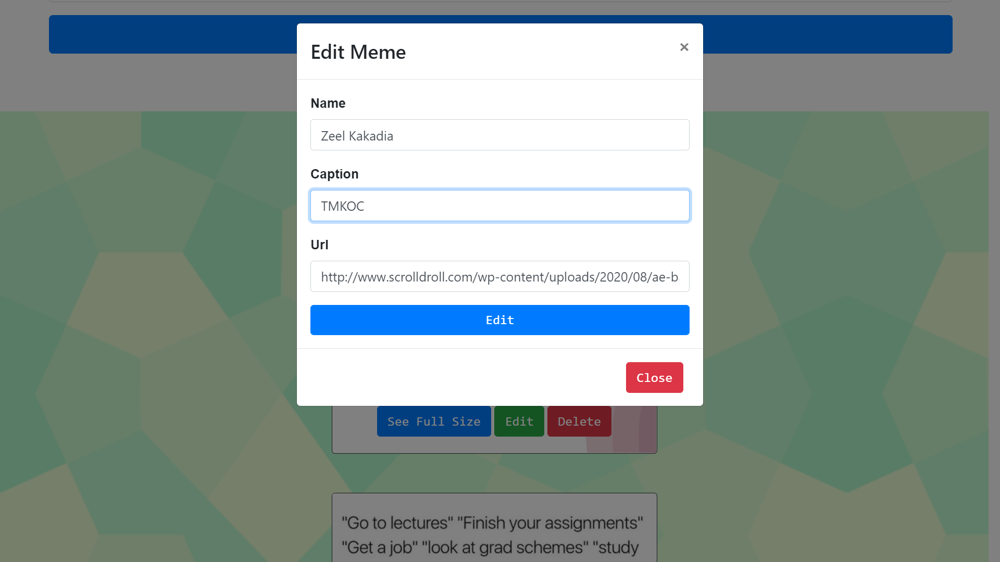
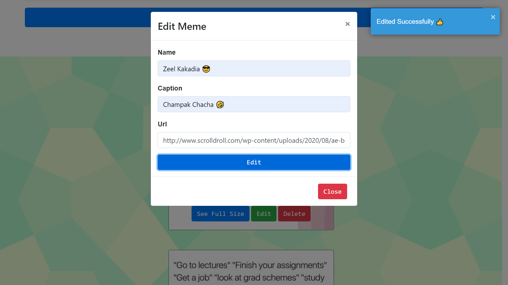
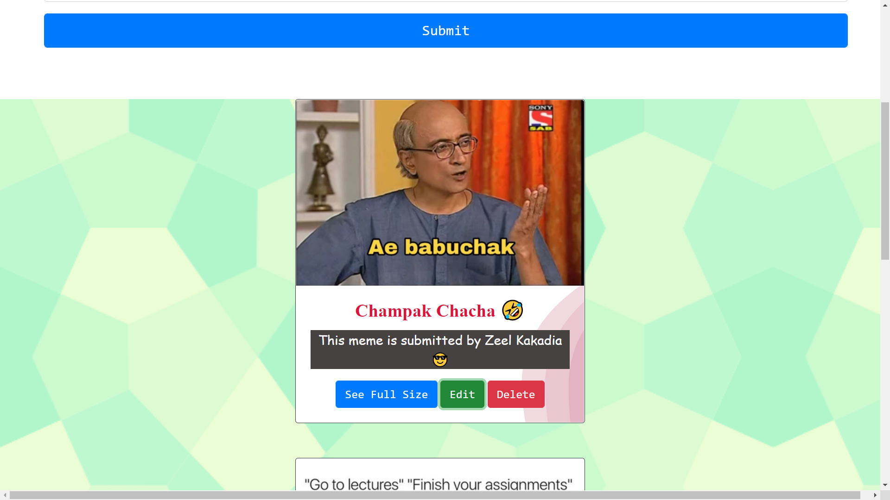
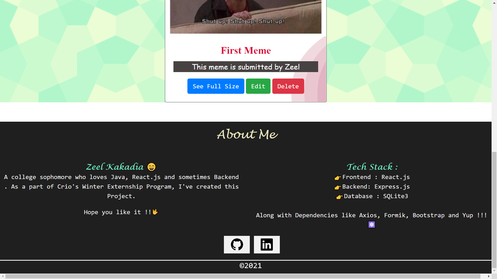

# Meme Collection

A meme collection is a website where one user can submit meme url and caption.
[Click to see Website](https://memecollection.herokuapp.com/)

## Description

This project was a part of  Crio's Externship Program of Stage 2B.

### Tools

* Front-end in React : Axios, React Bootstrap , Formik and Yup
* Backend : Express
* Database : SQLITE

## Snippets

## Author

Kakadia Zeel  

## Deployed Link

[https://memecollection.herokuapp.com/] Deployed on Heroku